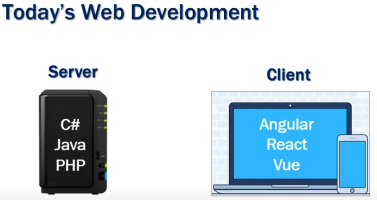
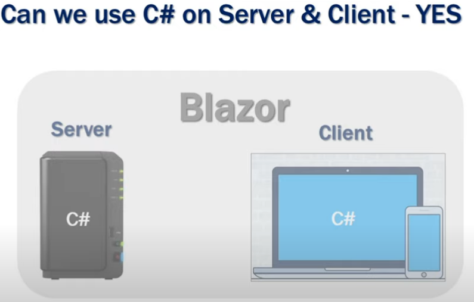
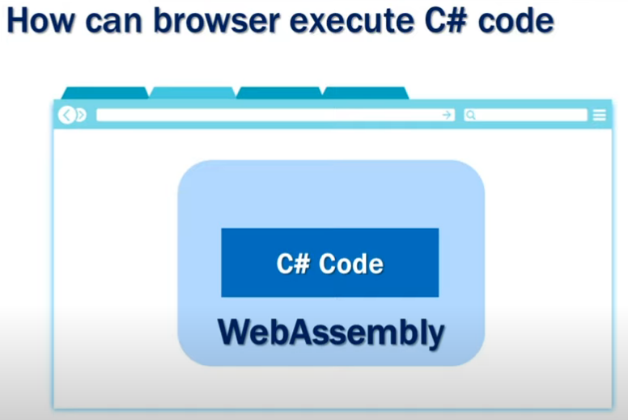
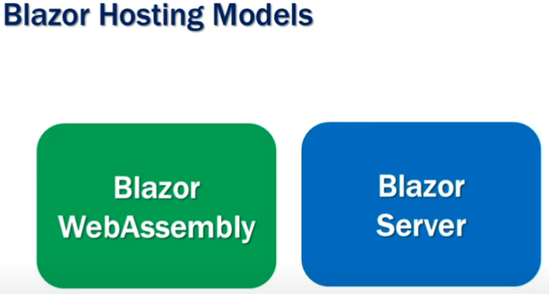
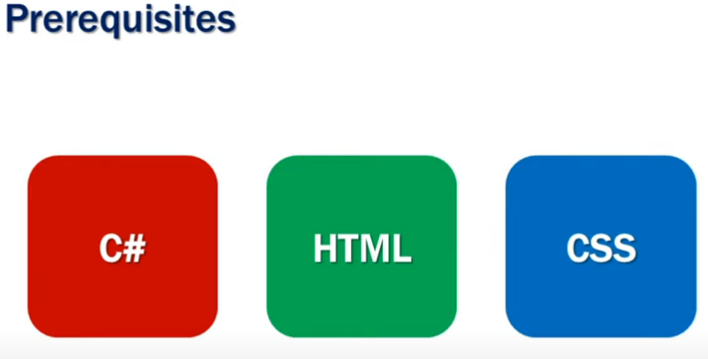
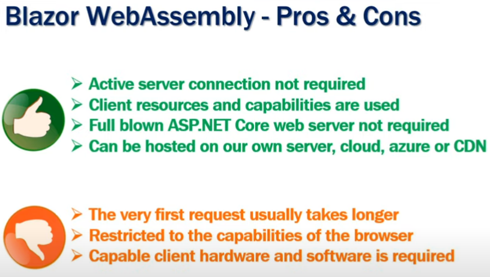
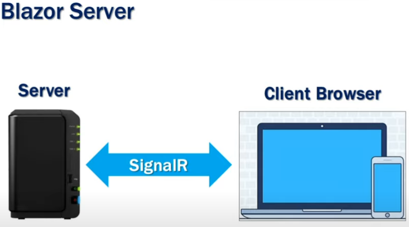
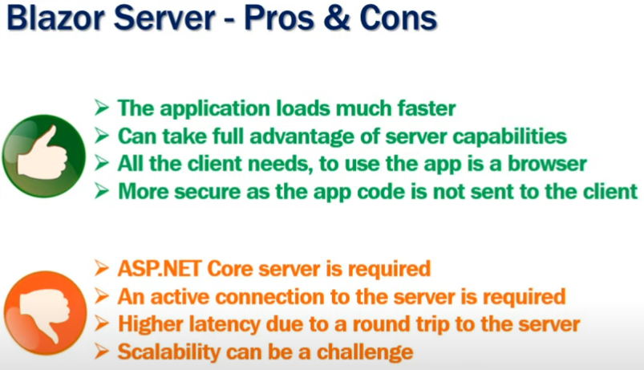

# Kudvenkat_BlazorProjects

- https://www.youtube.com/playlist?list=PL6n9fhu94yhVowClAs8-6nYnfsOTma14P kanalı ile geliştirilen uygulama

---

*Başlamadan önce: kaynağa destek olabilir ve daha çok kişiye erişmesini sağlayabilirsiniz.* 🎉⭐

---

1. [Giriş ve Tanışma](#giriş-ve-tanışma)
2. [What is Blazor](#What-is-Blazor)
3. [ASP NET Core Blazor Hosting Models](#ASP-NET-Core-Blazor-Hosting-Models)
4. [ASP NET Core Razor Components](#ASP-NET-Core-Razor-Components)

## Giriş ve Tanışma

Merhabalar.👋

Ben Kamil, F.Ü yazılım mühendisliği bölümünden 2020 yılının ocak ayında mezun oldum. Mezun olmadan 4 ay önce özel bir şirkette işi başladım ve halen çalışmaktayım.Oluşturduğum bu kaynak ile; blazor bilmeyen kişiler 
için öğrenmeyi, bilgisi olan kişiler için de bilgilerini güncel tutacağı ve bir problem olduğunda danışacağı bir başucu kaynağı olmasını hedefliyorum. Bu kaynağın ortaya çıkış amacından da kısaca bahsedecek olursam; şirkette 
yapılması planlanan projelerimiz için ve `BLAZOR` öğrenmekmek isteyanler için başvurucu bir kaynak olmasını temenni ediyorum.

## What is Blazor

`https://docs.microsoft.com/tr-tr/aspnet/core/blazor/templates?view=aspnetcore-3.1`
**Microsoft.AspNetCore.Blazor.Templates** : https://www.nuget.org/packages/Microsoft.AspNetCore.Blazor.Templates
<<<<<<< HEAD

## ASP.NET Core Blazor Hosting Models

### Blazor WebAssembly

#####  **AVANTAJLARI**

1. aktif sunucu bağlantısı gerekli değil.
2. istemci kaynakları ve yetenekleri kullanılır.
3. tam gelişmiş `ASP.NET Core` web sunucusu gerekli değil
4. kendi sunucumuzda, blut ortamında, azure'de ve CDN'de barındırılabilir.

##### **DEZAVANTAJLARI**

1. ilk istek genellikle daha uzun sürer
2. tarayıcının yetenekleriyle sınırlı
3. yetenekli istemci donanımı ve yazılımı gerekli

### Blazor Server

#####  **AVANTAJLARI**

1. uygulama çok daha hızlı yükleniyor
2. sunucu özelliklerinden tam olarak yararlanabilir
3. tüm müşterinin ihtiyacı, uygulamanın bir tarayıcı olduğunu görmek için
4. uygulama kodu istemciye gönderilmediğinden daha güvenli

##### **DEZAVANTAJLARI**

1. ASP.NET Core sunucusu gerekli
2. sunucuyla etkin bir bağlantı gerekiyor
3. sunucuya gidiş dönüş nedeniyle daha yüksek gecikme süresi
4. ölçeklenebilirlik zor olabilir

## ASP NET Core Blazor Hosting Models

`https://www.youtube.com/watch?v=1MkPWOiwLIM&list=PL6n9fhu94yhVowClAs8-6nYnfsOTma14P&index=3`

## ASP NET Core Razor Components

